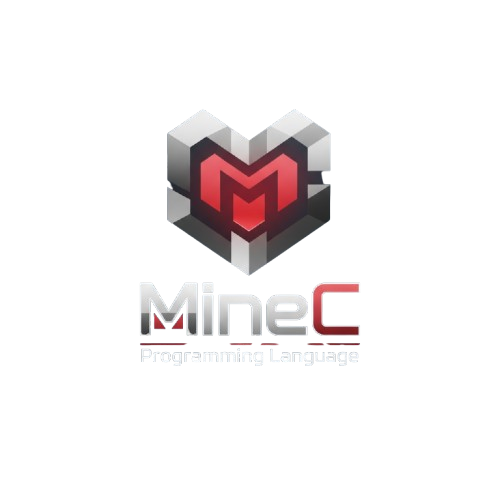

  

<h1 align="center"> MineC - Low-Level Language with x86-64 ASM Support 🚀</h1>

  <b>MineC</b> es un lenguaje de programación de bajo nivel con soporte nativo para ASM x86-64 embebido, diseñado para control total del hardware y depuración profunda.

<h2> Características</h2>
<ul>
  <li>✅ Sintaxis minimalista tipo C</li>
  <li>✅ Bloques ASM x86-64 embebidos directamente</li>
  <li>✅ VM híbrida (bytecode + ejecución ASM real)</li>
  <li>✅ Emulador completo de registros x86-64</li>
  <li>✅ Debugger interactivo paso a paso</li>
  <li>✅ Inspección de memoria, stack y registros</li>
  <li>✅ Sin dependencias externas</li>
</ul>

<h2> Estructura del Proyecto</h2>

<pre>
microc/
├── <b>token.h</b>          # Definiciones de tokens, opcodes, registros
├── <b>lexer.h/cpp</b>      # Tokenización del código fuente
├── <b>parser.h/cpp</b>     # Construcción del AST
├── <b>ast.h</b>            # Definición de nodos AST
├── <b>compiler.h/cpp</b>   # Compilación AST → Bytecode
├── <b>vm.h/cpp</b>         # Máquina virtual + emulador x86-64
├── <b>debugger.h/cpp</b>   # Debugger interactivo
├── <b>main.cpp</b>         # Punto de entrada
├── <b>Makefile</b>         # Build system
└── <b>examples/</b>
    └── <b>test.mc</b>      # Programa de ejemplo
</pre>

<h2> Compilación</h2>
<b>Requisitos:</b>
<ul>
  <li>g++ con soporte C++17</li>
  <li>Make</li>
</ul>

<b>Build:</b>
<pre>
make clean
make
</pre>

<b>Ejecutar:</b>
<pre>
./microc examples/test.mc
</pre>

<b>Modo Debug:</b>
<pre>
./microc examples/test.mc --debug
</pre>

<h2> Sintaxis del Lenguaje</h2>

  
<b>Declaración de Variables</b>

  <pre><code>int x = 10;
int y = 20;</code></pre>

  
<b>Funciones</b>

  <pre><code>void main() {
    int result = x + y;
    print(result);
}</code></pre>

  
<b>Operaciones Aritméticas</b>

  <pre><code>int a = 5 + 3;
int b = a * 2;
int c = b - 10;
int d = c / 2;</code></pre>

  
<b>Bloques ASM Embebido</b>

  <pre><code>asm {
    mov rax 42
    add rax 8
    push rax
}</code></pre>

  
<b>Print (salida a consola)</b>

  <pre><code>print(x + y * 2);</code></pre>

<h2> Arquitectura Técnica</h2>
<table>
  <tr>
    <th>Módulo</th>
    <th>Descripción</th>
  </tr>
  <tr>
    <td>Lexer</td>
    <td>Convierte código fuente en tokens</td>
  </tr>
  <tr>
    <td>Parser</td>
    <td>Construye el AST</td>
  </tr>
  <tr>
    <td>Compiler</td>
    <td>Traduce AST a bytecode híbrido</td>
  </tr>
  <tr>
    <td>VM</td>
    <td>Ejecuta bytecode y emula CPU x86-64</td>
  </tr>
  <tr>
    <td>Debugger</td>
    <td>Interfaz interactiva de depuración</td>
  </tr>
</table>

<h2> Ejemplo Completo</h2>

  
Ver ejemplo avanzado

  <pre><code>int a = 5;
int b = 10;

void main() {
    int sum = a + b;
    print(sum);
    
    asm {
        mov rax 100
        mov rbx 200
        add rax rbx
        push rax
    }
    
    int product = a * b;
    print(product);
    
    asm {
        pop rcx
        mov rdx 2
        add rcx rdx
        push rcx
    }
}
</code></pre>

<b>Salida esperada:</b>
<pre>15
50
=== CPU State ===
PC: 12
RAX: 300
RBX: 200
RCX: 302
RDX: 2
Flags: ZF=0 SF=0
Stack: [302]
</pre>

<h2> Debugging Paso a Paso</h2>
<pre>
$ ./microc examples/test.mc --debug

=== MicroC Debugger Commands ===
step (s)    - Ejecutar una instrucción
continue (c) - Ejecutar hasta el final
regs (r)    - Mostrar registros
stack       - Mostrar stack
quit (q)    - Salir debugger
help (h)    - Ayuda
</pre>

<h2> Casos de Uso</h2>
<ul>
  <li>Manipulación directa de registros</li>
  <li>Operaciones con stack</li>
  <li>Cálculos híbridos (high-level + ASM)</li>
</ul>

<h2> Extensiones Futuras</h2>
<ul>
  <li>Control de flujo: if, while, for</li>
  <li>Arrays y punteros</li>
  <li>Structs</li>
  <li>Funciones con parámetros</li>
  <li>Más instrucciones ASM</li>
  <li>Breakpoints y watch variables</li>
  <li>Memory dump</li>
  <li>Backend x86-64 nativo</li>
  <li>Optimizaciones</li>
</ul>

<h2> Flujo de Ejecución Completo</h2>

  

<h2> Diseño de Decisiones Clave</h2>
<ul>
  <li>VM híbrida: Portabilidad y debugging fácil</li>
  <li>Emulación de registros: Seguridad y educación</li>
</ul>

<h2> Testing</h2>

  
Test 1: Variables y Aritmética

  <pre><code>int x = 10;
int y = 5;

void main() {
    int z = x + y * 2;
    print(z);
}
// Salida esperada: 20
</code></pre>

  
Test 2: ASM Básico

  <pre><code>void main() {
    asm {
        mov rax 42
        add rax 8
    }
}
// Estado final RAX: 50
</code></pre>

<h2> Internals Deep Dive</h2>
<ul>
  <li>Variables globales y locales</li>
  <li>Formato de instrucciones</li>
  <li>Emulación de CPU y flags</li>
  <li>Parser de ASM simplificado</li>
</ul>

<h2> Conceptos Técnicos</h2>
<ul>
  <li>Compilación en dos fases</li>
  <li>Stack-based VM</li>
  <li>Híbrido Stack + Registros</li>
</ul>

<h2> Seguridad y Limitaciones</h2>
<ul>
  <li>✅ Aislado del sistema</li>
  <li>✅ Sin undefined behavior</li>
  <li>❌ No soporta memory addressing, jumps, recursión, floats</li>
  <li>✅ Soporta enteros, ASM inline, debugging</li>
</ul>

<h2> Troubleshooting</h2>
<ul>
  <li><b>Error:</b> "Unexpected token at line X"   <b>Solución:</b> Verifica sintaxis</li>
  <li><b>Error:</b> "Cannot open file"   <b>Solución:</b> Verifica existencia del archivo</li>
  <li><b>ASM no ejecuta correctamente:</b> Usa solo registros 64-bit</li>
  <li><b>Debugger no muestra cambios:</b> Usa <code>step</code> en vez de <code>continue</code></li>
</ul>

<h2> Comparación con Otros Lenguajes</h2>
<table>
  <tr>
    <th>Feature</th>
    <th>MicroC</th>
    <th>C</th>
    <th>Assembly</th>
    <th>Python</th>
  </tr>
  <tr>
    <td>High-level syntax</td>
    <td>✅</td>
    <td>✅</td>
    <td>❌</td>
    <td>✅</td>
  </tr>
  <tr>
    <td>Inline ASM</td>
    <td>✅</td>
    <td>✅</td>
    <td>N/A</td>
    <td>❌</td>
  </tr>
  <tr>
    <td>Interactive debug</td>
    <td>✅</td>
    <td>Ext.</td>
    <td>Ext.</td>
    <td>✅</td>
  </tr>
  <tr>
    <td>Register access</td>
    <td>✅</td>
    <td>Via ASM</td>
    <td>✅</td>
    <td>❌</td>
  </tr>
  <tr>
    <td>Memory safety</td>
    <td>✅</td>
    <td>❌</td>
    <td>❌</td>
    <td>✅</td>
  </tr>
  <tr>
    <td>Performance</td>
    <td>Medium</td>
    <td>High</td>
    <td>Highest</td>
    <td>Low</td>
  </tr>
</table>

<h2> Learning Path</h2>
<ol>
  <li>Básico: Compilar y ejecutar <code>examples/test.mc</code></li>
  <li>ASM Intro: Usar bloques <code>asm { }</code></li>
  <li>Debugging: Ejecutar en modo <code>--debug</code></li>
  <li>Avanzado: Modificar el compiler para nuevas features</li>
</ol>

<h2> Contribuir</h2>
<ul>
  <li>Agregar nueva instrucción ASM</li>
  <li>Agregar nuevo tipo de dato</li>
</ul>

<h2> Soporte</h2>
<ul>
  <li>Revisa sintaxis en ejemplos</li>
  <li>Verifica que todos los .cpp están compilados</li>
  <li>Usa <code>--debug</code> para diagnosticar</li>
</ul>
<b>Recursos:</b>
<ul>
  <li><a href="https://www.intel.com/content/www/us/en/developer/articles/technical/intel-sdm.html">x86-64 reference: Intel Manual Vol. 2</a></li>
  <li><a href="https://en.wikipedia.org/wiki/Compilers:_Principles,_Techniques,_and_Tools">Compiler design: Dragon Book</a></li>
  <li><a href="https://craftinginterpreters.com/">VM design: Crafting Interpreters</a></li>
</ul>

<h2> Licencia</h2>

<b>Apache License 2.0</b> - Libre para uso mientras se respete la licencia

<h2> Logros Técnicos</h2>
<ul>
  <li>✅ Lexer completo funcional</li>
  <li>✅ Parser recursivo descendente</li>
  <li>✅ Compilador AST → Bytecode</li>
  <li>✅ VM híbrida stack + registros</li>
  <li>✅ Emulador x86-64 con 8 registros + flags</li>
  <li>✅ Debugger interactivo tipo GDB</li>
  <li>✅ Sin dependencias externas</li>
  <li>✅ ~1000 líneas de código C++</li>
</ul>

<h2> Próximos Pasos</h2>
<ul>
  <li>Implementar control de flujo (<code>if</code>, <code>while</code>, <code>for</code>)</li>
  <li>Agregar funciones con parámetros</li>
  <li>Soportar arrays</li>
  <li>Memory addressing en ASM</li>
  <li>Backend x86-64 nativo</li>
</ul>

<h2> Filosofía de Diseño</h2>
<blockquote>
  "Simple pero poderoso" 
  MineC no intenta ser C++. Es una herramienta educativa y experimental para:
  <ul>
    <li>Entender cómo funcionan los compiladores</li>
    <li>Aprender x86-64 Assembly de forma segura</li>
    <li>Experimentar con lenguajes de bajo nivel</li>
    <li>Debugging profundo sin GDB</li>
  </ul>
  <b>Principios:</b>
  <ul>
    <li>Código legible sobre performance</li>
    <li>Modularidad sobre monolitos</li>
    <li>Seguridad sobre velocidad</li>
    <li>Educación sobre producción</li>
  </ul>
</blockquote>

<h2> Conclusión</h2>

MineC es un proyecto completo que demuestra:
<ul>
  <li>Diseño de lenguajes de programación</li>
  <li>Compilación multi-etapa</li>
  <li>Arquitectura de CPU x86-64</li>
  <li>Debugging a bajo nivel</li>
  <li>Integración VM + ASM nativo</li>
</ul>
<b>Total de componentes:</b>
<ul>
  <li>8 módulos C++</li>
  <li>~1200 líneas de código</li>
  <li>30+ instrucciones soportadas</li>
  <li>Debugger completo</li>
</ul>

